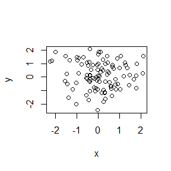

# Temp1

# Level 1 Header

## This is my header

This is a line of text

- bullet 1
- bullet 2


```r
x = rnorm(100)
y = rnorm(100)
plot(x,y)
```

<!-- -->


```r
summary(x)
```

```
##     Min.  1st Qu.   Median     Mean  3rd Qu.     Max. 
## -2.23402 -0.42820  0.01371  0.06282  0.62195  2.10427
```


